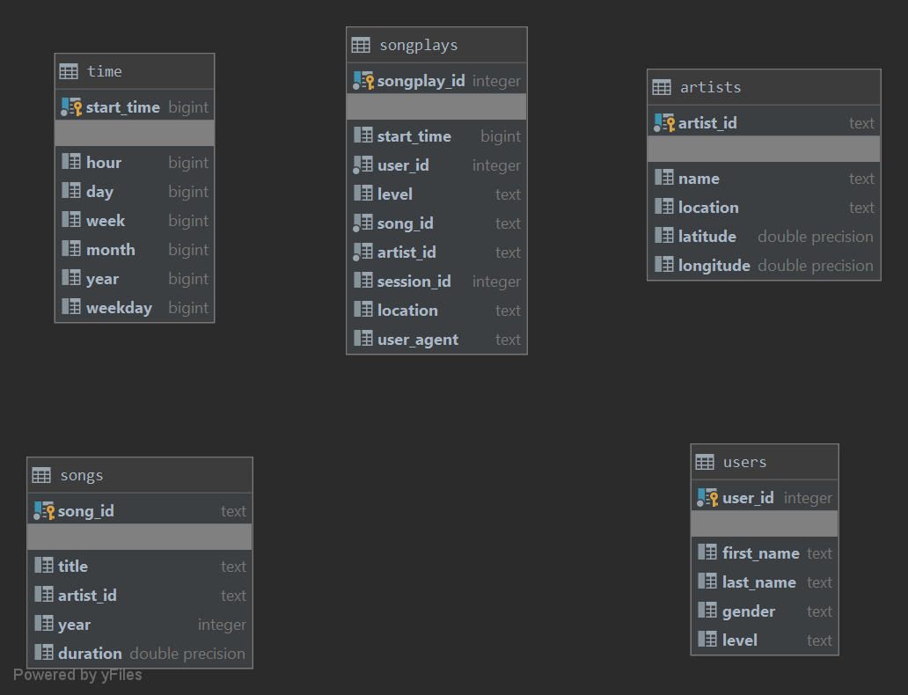

# Project: Data Modeling with Postgres
## Introduction
As stated in the project description, a startup called Sparkify wants to analyze the data they've been collecting on 
songs and user activity on their new music streaming app. The analytics team is particularly interested in understanding
what songs users are listening to. Currently, they don't have an easy way to query their data, which resides in a 
directory of JSON logs on user activity on the app, as well as a directory with JSON metadata on the songs in their app.

They'd like a data engineer to create a Postgres database with tables designed to optimize queries on song play 
analysis, and bring you on the project. Your role is to create a database schema and ETL pipeline for this analysis. 
You'll be able to test your database and ETL pipeline by running queries given to you by the analytics team from 
Sparkify and compare your results with their expected results.

## Project Description
The scope of the project covers the following aspects:
1. Create a star schema with fact and dimension tables reflecting the available data that would enable the analytics 
team to answer a question what songs users are listening to. 
2. Create python scripts for ETL jobs that could be run to populate the star schema tables.

## Schema Design 
The design of the schema is represented on the diagram below.

The schema provides a single point of a valuable from the analytics point of view information. It is captured in the
songplays table that was chosen as a a fact table. This choice is based on how each element of the data is connected and
makes it easy to join any important for querying detail that is being persisted in of of the dimension tables 
(songs, artists, users and time). 

### Table description

#### Songplays
Provides information about what song was played by a user
#### Songs
Provides information about songs available for the user to play
#### Artists
Provides information about the Artists that authored a song
#### Users
Provides information about the users of the Sparkify music service
#### Time
Represents an information about a timestamp in which a songplay entry was recorded in a convenient for querying format.
The column formats were chose for query convenience and ease of transformation.

## ETL pipeline description
The source data for the project is located in the `data/log_data` and `data/song_data` folders in `json`formatted files.
The first group features information about user behaviour on the Sparkify platform and the second group - information
about songs and their artists.

The `etl.py` script is recursively goes trough all the directories and subdirectories for each of the file groups to
generate a single dataframe for each group that is then transformed in order to prepare information for each table in
the schema. Once the data is ready, it is saved into the database with insert command.
The choice to concatenate all the files into a single dataframe makes it easy to separate different parts of the ETL job into
three logical groups. Once a group is finished processing, there is no need to go through it again. This makes the job
more extendable and easier to maintain.

The file contains helper functions to get the dataframe from the files and an individual processing files for each table.
More details on this can be found in docstrings and comments in `etl.py`

## Query examples

1. Get all the song titles, artist names and full name of the use that that listened to that song:

~~~~sql
SELECT ss.title, a.name, concat(u.first_name,' ', u.last_name)
FROM songplays s
    INNER JOIN songs ss
        ON s.song_id = ss.song_id
    INNER JOIN artists a ON s.artist_id = a.artist_id
    INNER JOIN users u ON s.user_id = u.user_id;
~~~~

2. Get Top three most prolific years (with most songs released). If several years have the same number of songs,
get all of them together as they share the same position.

~~~~sql
WITH songs_per_year AS (SELECT year::text, COUNT(1) AS num_of_songs
                        FROM songs
                        WHERE year != 0
                        GROUP BY year
                        ORDER BY COUNT(1) DESC)
SELECT num_of_songs, string_agg(year, ', ')
FROM songs_per_year
GROUP BY num_of_songs
ORDER BY num_of_songs DESC
LIMIT 3;
~~~~

3. Get top 10 longest songs (Artist name, title and duration)

~~~~sql
SELECT a.name, s.title, s.duration
FROM artists a
         INNER JOIN songs s
                    ON s.artist_id = a.artist_id
ORDER BY s.duration DESC
LIMIT 10;
~~~~

## How to run
 Make sure that the db is created (run `python create_tables.py`) and then execute the etl.py (run `python etl.py`)
 
 The console should result in the following output indicating that no errors occurred.
 

 