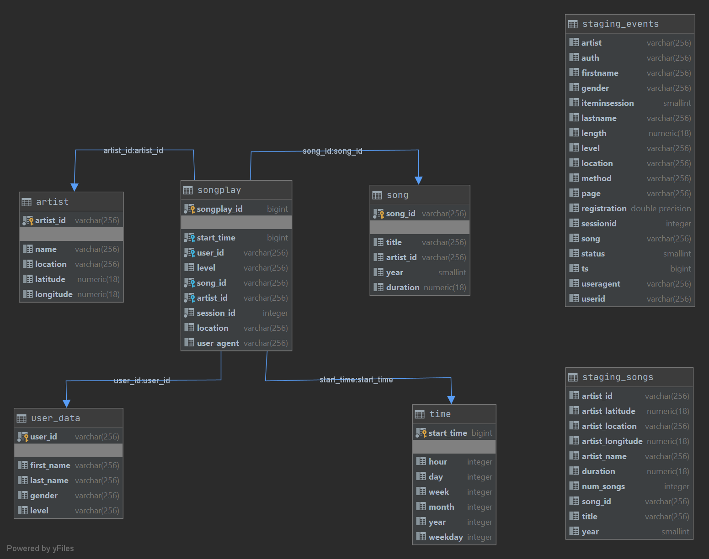

#Project: Cloud data warehousing (Redshift).
## Introduction.
A music streaming startup, Sparkify, has grown their user base and song database and want to move their processes and 
data onto the cloud. Their data resides in S3, in a directory of JSON logs on user activity on the app, as well as a 
directory with JSON metadata on the songs in their app.

As their data engineer, you are tasked with building an ETL pipeline that extracts their data from S3, stages them in 
Redshift, and transforms data into a set of dimensional tables for their analytics team to continue finding insights in 
what songs their users are listening to. You'll be able to test your database and ETL pipeline by running queries given 
to you by the analytics team from Sparkify and compare your results with their expected results.

In this project, you'll apply what you've learned on data warehouses and AWS to build an ETL pipeline for a database 
hosted on Redshift. To complete the project, you will need to load data from S3 to staging tables on Redshift and 
execute SQL statements that create the analytics tables from these staging tables.

## Files description.

1. create_infrastructure.py - the file that needs to be run in order to create infrastructure required for the redshift 
cluster to be available and connectable. This file may be ignored if the required infrastructure already exists.

1. create_tables.py - the file that needs to be run to create staging, facts and dimensions table for the Sparkify 
system.

1. etl.py - the file with the logic to populate staging, facts and dimensions table with the data stored in s3.

1. sql_queries.py - the file with sql queries required to be executed in the create_tables.py and etl.py functions.

1. redshift_utils.py - the file with some convenience methods to simplify connection to redshift.

1. dwh.cfg - template file with configurations required for the project to work correctly.

## Project Description
The scope of the project covers the following aspects:

1. Infrastructure creation (optional).
1. Table creation - based on the data, the tables represent a set of staging tables for the initial data load and a star.
schema that would be used for further data analysis.
1. Data population - ETL process to transfer the data from a set of json-formatted files in s3 to the star schema tables.

## Schema design
The design of the schema is represented on the diagram below.

The schema provides a single point of a valuable from the analytics point of view information. It is captured in the 
songplays table that was chosen as a a fact table. This choice is based on how each element of the data is connected and
 makes it easy to join any important for querying detail that is being persisted in of of the dimension tables 
 (songs, artists, users and time). The staging tables are also included to illustrate that the process of data ingestion
 is two-fold. This schema and its description is similar to the one of the Postgres project for the udacity course as 
 both are based on similar datasets.
 
### Table description
**Songplays** - Provides information about what song was played by a user

**Songs** - Provides information about songs available for the user to play

**Artists** - Provides information about the Artists that authored a song

**Users** - Provides information about the users of the Sparkify music service

**Time** - Represents an information about a timestamp in which a songplay entry was recorded in a convenient for 
querying format. The column formats were chose for query convenience and ease of transformation.

## ETL pipeline description.
The ETL process if based on the two following steps:

1. Copying data from the s3 locations s3://udacity-dend/song_data and s3://udacity-dend/log_data to sthe staging tables
2. Inserting the data from the staging tables to the facts/dimensions tables. Please note that before each table 
insertion, the data fould be deleted if it exists in the staging table. This is done in order provide merge 
functionality in the case of data being reprocessed or updated.

## How to run

### Configuration.
Before running any scripts, the user needs to provide the necessary information int the dwh.cfg file. Some of the values
are provided as a part of the template as reasonable defaults, others would need to be changed as indicated by the 
"UPDATE_ME" values in the configuration sections.
An example of a configuration file is provided below:

```
[IAM_ROLE]
ARN=arn:aws:iam::111111111111:role/dwhRole


[S3]
LOG_DATA='s3://udacity-dend/log_data'
LOG_JSONPATH='s3://udacity-dend/log_json_path.json'
SONG_DATA='s3://udacity-dend/song_data'
REGION='us-west-2'

[AWS]
KEY=UPDATE_ME
SECRET=UPDATE_ME

[DWH]
DWH_REGION=us-west-2
DWH_CLUSTER_TYPE=multi-node
DWH_NUM_NODES=4
DWH_NODE_TYPE=dc2.large

DWH_IAM_ROLE_NAME=dwhRole
DWH_CLUSTER_IDENTIFIER=dwhCluster
DWH_DB=dwh
DWH_DB_USER=dwhuser
DWH_DB_PASSWORD=Passw0rd
DWH_PORT=5439
```

Please note that the IAM_ROLE sectionrequires an account name to be replaced with the one used in the actual aws
environment.

### Scripts execution.

1. Run the create_infrastructure.py file to create a configured cluster. This is an optional step and can be ignored if
there already exists a cluster. If that is the case, please make sure that the configuration file is updated with the
details of the running cluster. The script might take about 10 minutes to execute as Redshift cluster takes some time
to be created.

1. Run the create_tables.py file to create a set of tables in accordance to the schema description.

1. Run the etl.py file to populate the tables with the data.


